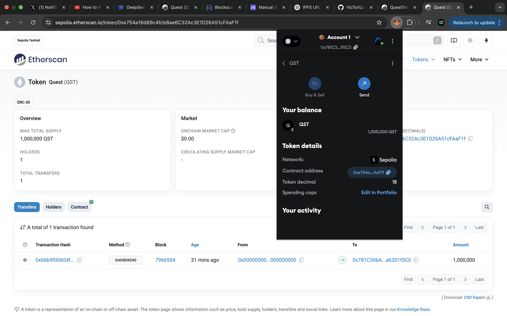

# Quest (QST) - ERC20 Token on Sepolia Testnet

A standard ERC20 token deployed on the Sepolia testnet using OpenZeppelin and Hardhat. This token serves as a test asset for decentralized applications.

---

## Contract Details
- **Token Name**: Quest  
- **Symbol**: QST  
- **Decimals**: 18  
- **Total Supply**: 1,000,000 QST  
- **Contract Address**: [`0xYourTokenAddress`](https://sepolia.etherscan.io/address/0xe754a16d89c4fcb8ae6C32Ac3E1D26A51cFAaF1f)  
- **Etherscan**: [View on Sepolia Etherscan](https://sepolia.etherscan.io/token/0xe754a16d89c4fcb8ae6C32Ac3E1D26A51cFAaF1f)  

---

## Metadata
- **Token Metadata (JSON)**: `https://hwj36jh5hbevagjdj523t5rkh2aybonvbldammcrpqkz3hinnw6q.arweave.net/PZO_JP04SVAZI091ufYqPoGAubUKxgYwUXwVnZ0Nbb0`  
- **Logo (128x128 PNG)**: `https://d2jyozzshqcznhoerxoryrlgi45m4zb4qwe7fe7hca6x5xnzfd3a.arweave.net/HpOHZzI8BZadxI3dHEVmRzrOZDyFifKT5xA9ft25KPY`  

---

**Token Logo**  
The token logo is hosted on Arweave:  
  
*Click the image to view the logo.*

---

## Token Preview
**MetaMask Display**  
  
*Screenshot showing 1,000,000 MTK balance in MetaMask.*
